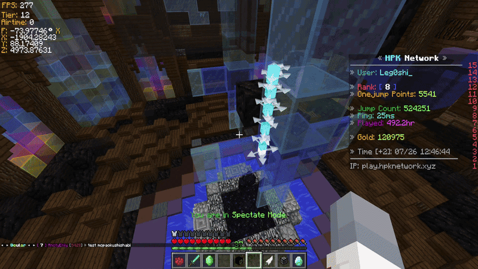

# Parkour Calculator

[](https://github.com/Leg0shii/ParkourCalculatorMod/actions/workflows/build.yml)
[](https://github.com/Leg0shii/ParkourCalculatorMod/releases/latest)
[](https://github.com/Leg0shii/ParkourCalculatorMod/releases)
[](https://modrinth.com/mod/parkourcalculator)
[](LICENSE)

A TAS input planning mod for Minecraft parkour. Plan inputs tick by tick, simulate them with Minecraft's real movement code, see the exact path in the world, and let the solver find the angles for you.



▶ [Creating a TAS Tutorial](https://youtu.be/y6Zqht6fyes) · ▶ [Video Showcase](https://www.youtube.com/watch?v=XecddwRXxXU)

## TASes created with the tool
- Juku Section (Top 1 Segmented): https://www.youtube.com/watch?v=DuOuvKRXtfw
- Drool City (Top 6 Rankup): https://www.youtube.com/watch?v=hz71P3R8YBo
- Utopica: https://www.youtube.com/watch?v=efh8SUA_13U
- Jumpcraft X: https://www.youtube.com/watch?v=OYNSGP5gSJI
- Jumpcraft XI: https://www.youtube.com/watch?v=Fu1xlAXp9UM
- Bedwars Lobby Parkour: https://www.youtube.com/watch?v=9A_4NfM1F4I

## Supported versions

| Jar | Minecraft | Loader | Java | Extra dependency |
|-----|-----------|--------|------|------------------|
| `pkc-fabric-<version>.jar` | 26.3 (tracks the latest release) | Fabric | 25 | Fabric API |
| `pkc-fabric-1.21.3-<version>.jar` | 1.21.3 | Fabric | 21 | none |
| `pkc-forge-1.8.9-<version>.jar` | 1.8.9 | Forge | 8 | none |
| `pkc-forge-1.12.2-<version>.jar` | 1.12.2 | Forge | 8 | none |

Every jar ships the same core: the input table, the simulation, the angle solver, the Stratfinder, the velocity map, and playback. Client-side only, no server component.

## Features

### Planning and simulation
- **Tick-by-tick inputs**: W/A/S/D, jump, sneak, sprint, left/right click, close inventory, hotbar slot, yaw and pitch per tick, plus Speed and Jump Boost amplifiers (up to 255) and per-tick teleport destinations. Hide the columns you do not use.
- **Real Minecraft physics**: the path is produced by a real player entity running the game's own movement code, so what you see is what the game does. No approximation, no drift.
- **Live path in the world**: every tick is a box; edit an input and the path updates immediately. Yaw arrows, hitboxes, sub-tick positions, hit distance lines and constraint plates can each be toggled and recolored.
- **In-world editing**: drag the start box to move the setup, Shift+drag to move it rigidly along collision-free ground, right-drag a box to set that tick's yaw, Ctrl+right-drag to set its pitch. Tapping a box selects the tick.
- **Editable start state**: position, velocity, rotation, on-ground, sprinting, wall contact, jump cooldown and sprint window are all editable; a resume state lets a TAS continue from a mid-run checkpoint.
- **Tick Info**: a configurable panel showing motion, speed, position, acceleration, in-game yaw, collision flags and more for the selected tick.
- **Paired client-server simulation** (singleplayer): a server-side player runs the same inputs through the real server code, so fall damage, velocity packets, rubber-banding and block interactions show up in the path and in the Server Events log.
- **Undo/redo** (Ctrl+Z / Ctrl+Y), optionally also while the UI is closed.

### Angle solver
- **Constraints per tick**: absolute X/Z/F, X/Z relative to any reference tick, per-tick dX/dZ/dF deltas, a dX-vs-dZ comparison, and RT (run-tick count). Each accepts a comparison or a range and can be disabled without deleting it.
- **Block-derived constraints**: look at a block and press `B` to add its landing footprint or wall as a constraint. Modifiers cover entering walls, unions of several blocks, pressure plates, ladders, vines, slime and ice.
- **Free start position**: the solver picks the best takeoff spot inside the start block's footprint.
- **Objectives**: maximize or minimize X or Z, or distance or motion along a custom facing angle; optional Smooth (TAS) scoring for human-playable turn shapes.
- **Effort levels**: Fast (first feasible), Optimize (anytime, keeps improving until the budget runs out) and Custom, where you pick or edit a solver graph in the node editor with per-node help and per-stage budgets. Built-in presets include Fast, Optimize, Fast (multi-start) and Fast (run ticks).
- **Run-ticks search**: let the solver insert run-up ticks before each jump instead of fixing the tick count by hand.
- **Byte-exact results**: the solver's own model is a bit-exact replica of the X/Z stepper, and every applied solve is re-verified through the real entity; a divergence is reported instead of hidden.
- **Failed-solve diagnostics**: a failed solve reports which constraints it missed and by how much.
- **Live status**: the HUD shows solve progress and outcome while the UI is closed.

### Stratfinder
- **No-turn lines**: a cold search over key schedules for byte-exact lines with one settable facing across the run-up and a single turn. Mark the no-turn ticks with dF = 0, set landing constraints, jump rows and a free-start box, and lines appear while the search runs.
- **Rankings**: sort by easiest (fewest input changes) or furthest (largest landing offset), optimize every line for a time budget, and optionally solve human-friendly yaws that aim for clearance.

### Velocity map
- Sweep launch velocities against a jump and see which ones land it, as a 2D heatmap or an orbitable 3D surface. Apply a cell to the start state with one click.

### Playback
- **Singleplayer replay**: play your inputs from the start, from a selected tick or over a range, with a configurable start delay and optional lockstep with the server. The replay freezes while the game is paused, the input table follows the active tick, and the path can stay visible during the replay.
- **Client-sided multiplayer replay**: on a server a ghost player replays the TAS for you alone. Your own player never moves and nothing is sent to the server.

### Files
- **Save and load** plans as JSON, browse them in folders with a name filter, reopen recent files, import a file someone sent you, and open the save folder from the Help menu. Saves remember the world they were made in.
- **Copy a tick as a teleport command** to jump straight to any point of the path.

## Multiplayer

Playback on a server is a client-sided replay: only you can see it, your own player never moves, and nothing is sent to the server. Playback that moves your player is deliberately restricted to singleplayer; on a server that would be macroing, and it will not be added.

## Usage

Press `G` to open the calculator. Every hotkey below is rebindable in Minecraft's **Controls** menu under the `Parkour Calculator` category.

### Adding inputs

1. File > New TAS, then right-click the table to add rows (or press `Insert`).
2. Click key cells to toggle inputs; drag across cells to set several at once.
3. Type yaw and pitch values, or right-drag a box in the world.

### Managing rows

- Click to select, Ctrl+Click to toggle, Shift+Click for a range
- `Delete` removes the selected rows, `Insert` adds rows at the selection
- Drag rows to reorder; right-click for duplicate, lock yaw/pitch, teleport and copy options

### Moving the start position

Click and drag the first box in the world. Hold Shift to move the whole path rigidly and keep it on collision-free ground.

## Controls

| Key | Action |
|-----|--------|
| `G` | Toggle UI |
| `P` | Start/stop playback |
| `B` | Add the targeted block's footprint (top face) or wall (side face) as a constraint on the selected tick |
| `Shift+B` | Wall constraint for entering the block's side instead of stopping at it |
| `Alt+B` | Merge the new footprint or wall with the existing constraint |
| `Ctrl+B` | Remove that constraint; on a pressure plate, ladder, vine, slime or ice block it adds the cell constraint instead |
| `X` | Remove the selected constraints |
| `V` | Solve and apply (Angle Solver) |
| `I` / `O` | Set the solver start / goal tick to the selected tick |
| `U` | Extend the path to the targeted block and solve |
| `H` | Fill per-tick slipperiness and medium from the recorded path |
| `J` | Rerun the simulation |
| `Y` | Toggle path rendering |
| `K` | Copy the selected tick as a teleport command |
| `L` | Deselect all |
| `Ctrl+S` | Save |
| `Ctrl+Z` / `Ctrl+Y` | Undo / redo |
| `Delete` / `Insert` | Remove / add rows |
| Right-drag a box | Set that tick's yaw (Ctrl+right-drag: pitch) |
| Shift+drag the start box | Move the path rigidly |
| `M` / `N` / `K` / `Delete` | Experimental block capture (momentum / collision / land / clear), only when enabled in Preferences |

## Installation

Releases ship one jar per loader, on [Modrinth](https://modrinth.com/mod/parkourcalculator) and on the [GitHub releases page](https://github.com/Leg0shii/ParkourCalculatorMod/releases/latest). `<version>` is the release tag without the `v` prefix (e.g. `1.12.0`).

### Fabric (latest Minecraft, currently 26.3)

1. Install the [Fabric Loader](https://fabricmc.net/use/installer/) for the Minecraft version named in the release notes.
2. Install [Fabric API](https://modrinth.com/mod/fabric-api) into your `mods` folder.
3. Drop `pkc-fabric-<version>.jar` into the same `mods` folder.
4. Launch the Fabric profile for that Minecraft version.

### Fabric 1.21.3

1. Install the [Fabric Loader](https://fabricmc.net/use/installer/) for 1.21.3 (no additional APIs required).
2. Drop `pkc-fabric-1.21.3-<version>.jar` into your `mods` folder.
3. Launch the 1.21.3 Fabric profile.

### Forge 1.8.9

1. Install [MinecraftForge for 1.8.9](https://files.minecraftforge.net/net/minecraftforge/forge/index_1.8.9.html) (no additional APIs required).
2. Drop `pkc-forge-1.8.9-<version>.jar` into your `mods` folder.
3. Launch the 1.8.9 Forge profile.

### Forge 1.12.2

1. Install [MinecraftForge for 1.12.2](https://files.minecraftforge.net/net/minecraftforge/forge/index_1.12.2.html) (no additional APIs required).
2. Drop `pkc-forge-1.12.2-<version>.jar` into your `mods` folder.
3. Launch the 1.12.2 Forge profile.

After launch, open the in-game **Mods** menu to confirm Parkour Calculator is listed.

## Building from source

The Gradle daemon runs on JDK 21. The Fabric 26.3 module uses a JDK 25 toolchain and the 1.21.3 module a JDK 21 toolchain, both auto-provisioned; the two Forge modules need a local JDK 8.

```bash
./gradlew :core:test                      # fast test suite (no Minecraft needed)
./gradlew :loader-fabric:build            # -> loader-fabric/build/libs/pkc-fabric-<version>.jar
./gradlew :loader-fabric-1.21.3:build     # -> pkc-fabric-1.21.3-<version>.jar
./gradlew :loader-forge-1.8.9:build       # -> pkc-forge-1.8.9-<version>.jar
./gradlew :loader-forge-1.12.2:build      # -> pkc-forge-1.12.2-<version>.jar
./gradlew build                           # everything
```

Modules: `core/` is the Minecraft-free UI, data and solver code (Java 8), `forge-core/` holds the parts shared by both Forge loaders, and each `loader-*/` module contains the Minecraft-touching simulation, rendering and entry point for one version. See [`AGENTS.md`](AGENTS.md) for the architecture and [`CONTEXT.md`](CONTEXT.md) for the parkour and movement vocabulary.

## Contributing

See [`CONTRIBUTING.md`](CONTRIBUTING.md) for the full workflow. Quick summary: `main` holds released code and `dev` is the integration branch. Feature branches come off `dev` and are squash-merged into it with a [Conventional Commits](https://www.conventionalcommits.org/) PR title (`feat:`, `fix:`, `feat!:`); a weekly train merges `dev` into `main` as a merge commit. Versioning, tagging, the CHANGELOG and the publication of the four loader jars to GitHub and Modrinth are automated via [release-please](https://github.com/googleapis/release-please).

## Community

- Discord: https://discord.gg/minecraft-tas-373166430478401555
- Bug reports and feature requests: https://github.com/Leg0shii/ParkourCalculatorMod/issues
